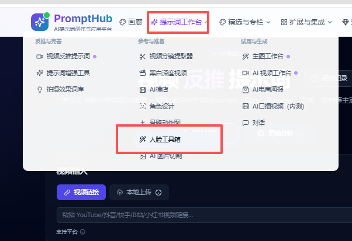
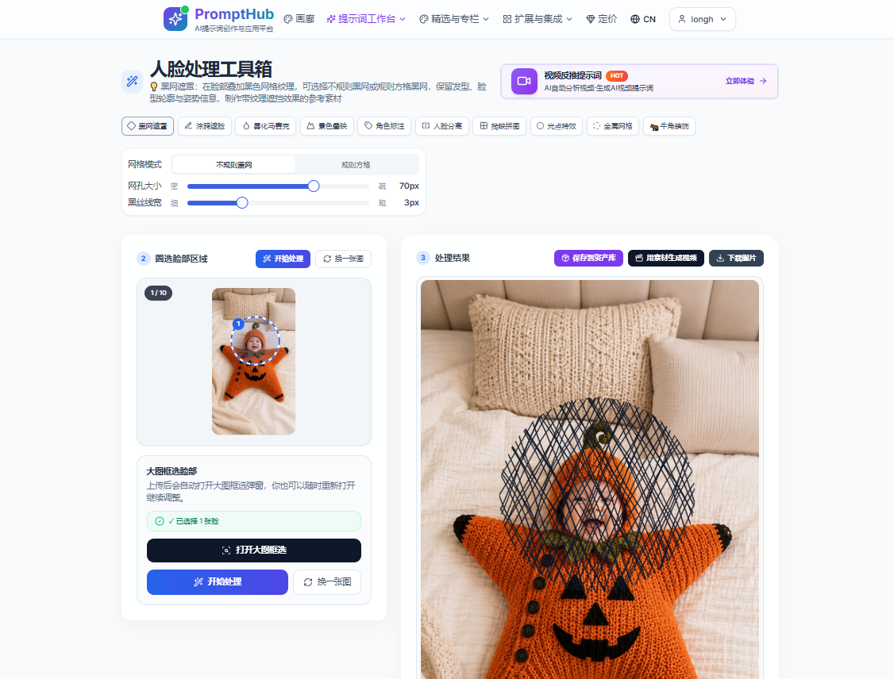

<div align="center">

# Cross-Border E-commerce AI Video Production

**Codex Skills and field-tested prompt SOPs for producing complex AI commerce videos at lower cost.**

Write the script and voiceover first, generate and validate the human-model first frame and product images, prepare face-mask references, turn images into video, build a high-retention grid opening, and use Codex or Claude to break down reference videos.

[](https://github.com/Longxiaohao/AIvideo/stargazers)
[](./LICENSE)
[](./skills)
[](#automatic-routing)

[中文](./README.md) | **English**

</div>

---

## Why I Built This Project

I organized the prompts, routing rules, and lessons from my own cross-border e-commerce video projects into a reusable SOP. Anyone making commerce videos or preparing an AI-video portfolio can follow the same route, avoid some of the detours, and use the free Doubao Seedance Fast workflow with Grok and Veo to cover most of the path from scripting and image generation to image-to-video.

With complete product information and references, the workflow can switch between tools and aims to produce a fairly complex AI commerce video within one hour. It can also serve as a practical production reference and portfolio workflow. Actual time still depends on generation queues, product difficulty, and retries.

The prompts in this repository are the original versions I actually use. The Skills only identify the task, check the inputs, and route the workflow. I do not rewrite or shorten these prompts just to make them look cleaner or more polished.

## Core Workflow


1. Use Codex or Claude to break down a successful reference video and extract its opening structure, shots, production actions, and pacing.
2. Write the script and voiceover from verified product facts, locking the audience, dialogue, scenes, and target duration.
3. Generate and validate the human-model first frame, product displays, parent-child DIY scenes, unboxing images, or first and last frames from the character requirements, product image, dimensions, and script.
4. When a portrait needs masking, keep the original and create a separate processed face reference.
5. Select Veo 3.1, Grok, or the free Doubao Seedance Fast according to budget and task complexity.
6. Build a high-retention opening from grid assets, then complete standard editing, sound, and delivery.

## Human-Model First-Frame Module

> **This workflow is primarily image-to-video, so the image determines the video's realism.**

In my actual projects, the first frame is the part of a real-person video I cannot afford to rush. If the face, skin, hair, fingers, visible mouth, product scale, or person-product action is already wrong in the still image, Veo, Grok, or Seedance will not repair it automatically. Motion usually makes the defect more obvious. I therefore finish and inspect the human-model first frame before moving on to face masking or image-to-video.

I keep the two prompts I currently use as separate source files in the English-named [`human-model-prompts`](./skills/facebook-diy-video-workflow/references/human-model-prompts/) directory. I do not blend them into a newly rewritten prompt:

| Module | When I use it | Additional runtime inputs |
| --- | --- | --- |
| [`natural-lifestyle-first-frame-prompt.md`](./skills/facebook-diy-video-workflow/references/human-model-prompts/natural-lifestyle-first-frame-prompt.md) | A warm, natural, non-influencer lifestyle model whose description and action change with the product | Short character and outfit description, real person-product action, product image, and dimensions when scale matters |
| [`beauty-presenter-first-frame-prompt.md`](./skills/facebook-diy-video-workflow/references/human-model-prompts/beauty-presenter-first-frame-prompt.md) | A 9:16 front-facing Chinese skincare-presenter frame with detailed skin, makeup, wardrobe, lighting, and negative constraints | `参考的妆容.jpg`, `发箍.png`, `服装.png`, plus a product reference when the product appears |

Both files preserve the original Chinese text I supplied. For case one, I pass the short character-and-outfit description and the person-product action as separate project inputs instead of writing them into the source file. For case two, I supply every named reference image rather than pretending the model has seen a missing file. I then place the selected source prompt, references, and separate project facts into GPT Web and generate the frame with [GPT Image 2](https://developers.openai.com/api/docs/models/gpt-image-2).

I inspect the result for a natural face, consistent exposed-skin texture, correct hands and fingers, unobstructed eyes and mouth, correct product structure and scale, believable contact between the person and product, and the absence of unintended text or interface elements. If a critical check fails, I regenerate the still instead of sending it into the video stage.

## Tool Fallback Strategy

The same script and assets can move between tools according to budget, queue time, and generation quality without rebuilding the entire workflow.

| Task | Preferred tool | What the Skill handles |
| --- | --- | --- |
| Winning-video breakdown | Codex / Claude | Extracts shots, actions, pacing, and reusable structure |
| Human-model first frame | GPT Web / GPT Image 2 | Locks character, skin, hands, product scale, and opening composition |
| Complex multi-scene video | Veo 3.1 | Defines jump-cut timing, multi-angle camera paths, and continuity locks |
| Fast image-to-video | Grok / Veo | Compresses the plan into a physically executable short-video unit |
| Face-reference preprocessing | PromptHub Face Tools | Preserves character, product, and dialogue anchors |
| High-retention opening | Independent grid assets | Breaks down the opening structure and organizes shot order |

Fallback changes the execution tool only. It must not alter verified product facts, exact dialogue, scale, assembly steps, or any original prompt.

## Face-Mask Module

When I use a real-person reference in Seedance, I first create a processed version of the face, then provide both the original portrait and the processed image to the video workflow. I currently use [PromptHub Face Tools](https://prompthub.xin/lab/face-tools), sign in with an [email account](https://prompthub.xin/en/auth/login), and use the face-processing features that are free at the moment.

I am sharing it simply because I have found it free and convenient to use. This is not an advertisement, sponsorship, or commercial partnership. The site's login methods, free tier, and features may change, so check the current page before using it. Before uploading a portrait, make sure you have permission to use it and accept the site's privacy terms.

### Tool Entry

Open Prompt Workspace in PromptHub and select Face Tools.



### How I Use It

1. Keep the untreated portrait as the primary reference for identity, hair, clothing, and pose.
2. Upload the portrait and mark only the face region. Do not cover the product, hands, or body action.
3. Choose Black Fishnet, Scribble Mask, Fog Mosaic, Face Separation, Puzzle Pieces, or the treatment required by the task.
4. Download the result as a separate file and never overwrite the original portrait.
5. Provide both the original portrait and the processed face reference to Seedance, then continue with the immutable Seedance prompt.



Face masking prepares a reference image only. It does not modify the product, dialogue, actions, scene, or video prompt.

## A Problem I Hit: Complex Products Are Hard to Generate

I learned this the hard way on real projects: not every product can go straight into GPT Image 2 and then into image-to-video. As soon as a product has lots of edges, crossing wires, exact connections, or many repeated small parts, AI starts getting the perspective and structure wrong.


Take the two-way wired product above. It is not simply a pair of outlets. The cable path, split, bends, coils, endpoints, plug direction, and outlet direction all have to stay correct. In my tests, AI could make something that looked similar at first glance, but it often rerouted a wire, invented a connection, merged two paths, or produced physically impossible perspective.

I ran into the same problem with products that contain many small clothes clips. GPT Image 2 often could not get even the still image right: the number, direction, and attachment points of the clips would drift. Once I used one of those incorrect images for video, the result was usually unusable.

### I First Decide Whether the Shot Is Worth Generating

My rule is straightforward: when a shot requires AI to preserve complex wiring, several exact connectors, many repeated parts, a complete disassembly sequence, or a strict installation order, I normally recommend not generating that shot. It may be possible after enough attempts, but the retries and cost are usually not worth it.

On a company project, I explain the structural risk and likely reroll cost first, then discuss a shot change with my manager or project lead. I can replace the complex disassembly with a finished-result shot, a presenter holding the product, a detail view, packaging, voice-over explanation, or real product footage. I keep the communication goal of the shot without forcing AI to perform the full complex process.

A completed storyboard or image grid does not prove that the video will work. A still image only has to look plausible for one frame. Image-to-video has to preserve cable paths, part counts, connector positions, hand contact, and spatial perspective over time. In my experience, this leads to frustrating repeated rerolls: the first frame can look correct, but the product may deform, disconnect, gain or lose parts, or change topology as soon as it moves.

### If the Shot Is Mandatory, I Convert It First

- I do not ask AI to complete a long disassembly, assembly, threading sequence, or several structural changes in one shot. I first convert it into a verified finished state with voice-over, removing the complex process from the visible action.
- When an operation must be shown, I reduce it to one local area, one connector, or one simple action. Critical structure and real usage relationships stay in real close-up footage, real product images, or manually corrected material.
- AI can handle the person, room, atmosphere, packaging, and ordinary presentation. I keep the product mostly static and use only restrained camera or environmental motion instead of combining complex hand action, product motion, and aggressive camera movement.
- If the company still requires generation, I explain the failure rate and rework cost in advance. An approved storyboard or image grid does not mean the video will be usable, so the schedule and budget need room for repeated rerolls.
- If structural drift continues after repeated attempts, I stop the generative branch and switch to real footage, a subtle push on a still image, or an editorial transition instead of spending more video credits.

## Capabilities

- **Facebook mature-audience voiceovers**: generate natural spoken scripts for North American audiences aged 35–45 from product references.
- **Human-model first frames**: use either the natural lifestyle or beauty-presenter source prompt to generate and validate an image-to-video character master with GPT Image 2.
- **DIY reference-video recreation**: analyze real production steps and generate a 15-second Facebook AI-video script.
- **Parent-child DIY image-to-video**: generate three independent 9:16 American family DIY images with GPT Image 2, then compile a Veo 3.1 or Grok first-and-last-frame video prompt.
- **Multi-scene product display**: after the voiceover, generate three independent 9:16 product images in distinct scenes by default.
- **First-person unboxing**: route unboxing intent to the factory-old-man first-person branch.
- **Veo / Grok video prompts**: handle talking people, product demonstrations, product-only scenes, continuous takes, and explicit multi-scene jump cuts.
- **Seedance Fast prompts**: generate compact, continuous, physically executable video units from the product's real usage method.
- **Face-mask preprocessing**: create a separate face-mask reference before Seedance while keeping the original portrait as the identity anchor.
- **Complex-product risk screening**: identify wire, connector, repeated-part, and disassembly risks before generation, recommend avoiding the complex generated shot by default, and provide a company-discussion, shot-conversion, or real-footage path.
- **Cinematic giant visuals**: create image or video prompts for Chinese dragons, deities, giants, mysterious beings, and disaster-scale scenes.

## Who It Is For

- Individuals and teams producing TikTok, Facebook, or other cross-border e-commerce videos.
- Creators building a stable AI-video pipeline with free or lower-cost tools.
- Job seekers targeting AI video, AIGC content, or cross-border e-commerce creative roles.
- Anyone who needs to assemble a portfolio piece, test video, or complex sample quickly.

## Automatic Routing

`facebook-diy-video-workflow` selects a branch from natural-language intent:

| User mentions | Automatic action |
| --- | --- |
| Human-model module, real-person first frame, or talking-head character master | Select one original human-model prompt, generate and validate it with GPT Image 2, then continue to video |
| `Seedance` | Prioritize the Seedance Fast branch |
| Face masking, Black Fishnet, Scribble Mask, or Face Separation | Create a separate processed face reference, then continue to the Seedance video branch |
| Complex wires, many connectors, repeated parts, disassembly, or installation | Recommend avoiding the complex generated shot by default; on company work, discuss a shot change first, then use a finished result, real close-up, or simple action if it remains mandatory |
| Parent-child DIY, mother-daughter DIY, family crafting | Generate three independent GPT Image 2 images, then enter the Veo/Grok first-and-last-frame branch |
| `Veo`, `Veo 3/3.1`, or `Grok` | Enter the Veo/Grok multi-scene and continuous multi-angle camera branch |
| Unboxing, opening the box, or opening the package | Enter the factory-old-man first-person unboxing branch |
| Facebook voiceover, mature-audience voiceover, or GPT full workflow | Enter the Facebook spoken-script branch |
| DIY, reference-video breakdown, or production-step recreation | Enter the DIY reference-video recreation branch |
| Voiceover complete with no unboxing or video-tool trigger | Generate three independent multi-scene product images by default |

An explicit Seedance request takes priority. Parent-child DIY overrides the generic product-image, unboxing, and direct Veo/Grok branches unless the user explicitly requests them as separate deliverables. When both Seedance and Veo/Grok are requested, the Skill produces separate outputs in the requested order and never merges their source prompts.

## Installation

### Ask an AI Assistant to Install It (Recommended)

Send this to Codex:

> Install the AIvideo Skills from GitHub:
>
> https://github.com/Longxiaohao/AIvideo
>
> Install `facebook-diy-video-workflow` and `cinematic-giant-visual-prompts`, validate both Skills, and tell me whether I need to refresh the session.

### Manual Installation

Clone the repository:

```bash
git clone https://github.com/Longxiaohao/AIvideo.git
cd AIvideo
```

Windows PowerShell:

```powershell
Copy-Item -Recurse -Force .\skills\facebook-diy-video-workflow "$env:USERPROFILE\.codex\skills\facebook-diy-video-workflow"
Copy-Item -Recurse -Force .\skills\cinematic-giant-visual-prompts "$env:USERPROFILE\.codex\skills\cinematic-giant-visual-prompts"
```

macOS / Linux:

```bash
mkdir -p ~/.codex/skills
cp -R skills/facebook-diy-video-workflow ~/.codex/skills/
cp -R skills/cinematic-giant-visual-prompts ~/.codex/skills/
```

After installing or updating, refresh the current session so Codex can rediscover the Skills.

## Usage

Use natural language after installation. You do not need to select reference files manually.

| Example request | What the Skill does |
| --- | --- |
| "Use the natural lifestyle model prompt to make a real-person first frame for this product." | Requires the character, outfit, and product action, then runs case one and validates the frame |
| "Use the skincare-presenter prompt for a 9:16 talking-head character master." | Checks the makeup, headband, and clothing references, then runs case two |
| "Write a Facebook mature-audience voiceover from this product image." | Runs the GPT full-workflow voiceover prompt |
| "Analyze this DIY reference video and recreate its production steps." | Runs the DIY reference-video recreation prompt |
| "Create parent-child DIY scenes, then make a Veo 3.1 video." | Generates three separate Image 2 frames and uses images 1 and 3 as the first and last frames |
| "Create three different product-display scenes after the voiceover." | Requires product and size references, then generates three independent 9:16 images |
| "Make a factory first-person unboxing for this product." | Requires product dimensions and action references, then enters the unboxing branch |
| "Turn this script into a Veo 3.1 multi-scene prompt." | Outputs mode selection, lock card, camera path, timeline, and final Veo prompt |
| "Write a Grok multi-angle product-video prompt." | Applies the Veo/Grok continuous multi-angle camera rules |
| "Write a 10-second Seedance prompt from the real usage method." | Prioritizes the Seedance Fast branch |
| "Mask this portrait before making the Seedance video." | Keeps the original portrait, creates a separate processed reference, then enters the Seedance branch |
| "This product has complex wires and connectors. Check whether AI can generate it." | Checks topology, perspective, and repeated-part risks, then recommends generation, split shots, or real footage |
| "Create a video prompt for a Chinese dragon over a stormy city." | Uses the cinematic giant-visual Skill |

Explicit invocation is also supported:

```text
Use $facebook-diy-video-workflow to turn my product facts and reference images into a Veo 3.1 prompt.
```

```text
Use $cinematic-giant-visual-prompts to create a realistic Chinese dragon video prompt.
```

## Recommended Inputs

- Finished-product, front, side, and detail images.
- A dimensions image or a scale comparison with a hand, person, or common object.
- Correct usage, assembly order, contact points, and action results.
- A winning reference video, first frame, character master image, or packaging reference.
- A short character and outfit description plus the person-product action for the natural model; the beauty-presenter case also needs makeup, headband, and clothing references.
- Product, dimensions, material-kit, DIY-tool, and picture-instruction references for parent-child DIY.
- Dialogue, voiceover, and sound requirements that must remain verbatim.
- Target tool, duration, aspect ratio, scene count, and whether jump cuts are allowed.

If missing information would change product scale, production method, or a key action, the Skill asks for it instead of inventing it.

## Project Structure

```text
AIvideo/
├── README.md
├── README.en.md
├── LICENSE
├── docs/
│   └── images/
│       ├── prompthub-face-tools-entry.png
│       ├── prompthub-face-mask-example.png
│       └── complex-wired-product-example.jpg
└── skills/
    ├── facebook-diy-video-workflow/
    │   ├── SKILL.md
    │   ├── agents/
    │   │   └── openai.yaml
    │   └── references/
    │       ├── gpt-full-workflow.md
    │       ├── video-breakdown-recreation-prompt.md
    │       ├── multi-scene-product-display-prompt.md
    │       ├── factory-old-man-unboxing-prompt.md
    │       ├── parent-child-diy-image-prompt.md
    │       ├── human-model-prompts/
    │       │   ├── natural-lifestyle-first-frame-prompt.md
    │       │   └── beauty-presenter-first-frame-prompt.md
    │       ├── face-mask-preprocessing.md
    │       ├── complex-product-generation-risks.md
    │       ├── veo-grok-multi-scene-prompt.md
    │       └── seedance-fast-10s-prompt.md
    └── cinematic-giant-visual-prompts/
        ├── SKILL.md
        ├── agents/
        │   └── openai.yaml
        └── references/
            └── original-prompt.md
```

## Prompt Integrity

The reference prompts below come directly from the workflow I actually use:

- [`gpt-full-workflow.md`](./skills/facebook-diy-video-workflow/references/gpt-full-workflow.md): complete Facebook mature-audience voiceover workflow.
- [`video-breakdown-recreation-prompt.md`](./skills/facebook-diy-video-workflow/references/video-breakdown-recreation-prompt.md): DIY reference-video breakdown and recreation.
- [`multi-scene-product-display-prompt.md`](./skills/facebook-diy-video-workflow/references/multi-scene-product-display-prompt.md): three independent multi-scene product images.
- [`factory-old-man-unboxing-prompt.md`](./skills/facebook-diy-video-workflow/references/factory-old-man-unboxing-prompt.md): factory first-person unboxing.
- [`parent-child-diy-image-prompt.md`](./skills/facebook-diy-video-workflow/references/parent-child-diy-image-prompt.md): three independent parent-child DIY scene images.
- [`natural-lifestyle-first-frame-prompt.md`](./skills/facebook-diy-video-workflow/references/human-model-prompts/natural-lifestyle-first-frame-prompt.md): warm, natural, non-influencer human-model first frame.
- [`beauty-presenter-first-frame-prompt.md`](./skills/facebook-diy-video-workflow/references/human-model-prompts/beauty-presenter-first-frame-prompt.md): 9:16 skincare-presenter talking-head first frame.
- [`veo-grok-multi-scene-prompt.md`](./skills/facebook-diy-video-workflow/references/veo-grok-multi-scene-prompt.md): Veo/Grok continuous multi-angle camera work and multi-scene video.
- [`seedance-fast-10s-prompt.md`](./skills/facebook-diy-video-workflow/references/seedance-fast-10s-prompt.md): Seedance Fast video unit.
- [`original-prompt.md`](./skills/cinematic-giant-visual-prompts/references/original-prompt.md): cinematic giant image and video prompts.

I will keep improving the Skill's triggering and routing, but the reference prompts above remain immutable source text by default.

Face masking and complex-product screening are operational modules that do not rewrite the field-tested prompts above:

- [`face-mask-preprocessing.md`](./skills/facebook-diy-video-workflow/references/face-mask-preprocessing.md): face-reference preprocessing workflow.
- [`complex-product-generation-risks.md`](./skills/facebook-diy-video-workflow/references/complex-product-generation-risks.md): complex-product feasibility checks and fallback rules.

## Repository Boundaries

The repository contains the instructions and prompts required by the Skills plus documentation images explicitly authorized for public use. Other product images, reference videos, generated media, analysis caches, and archives stay outside GitHub and are supplied as runtime attachments.

## Contributing

[Issues](https://github.com/Longxiaohao/AIvideo/issues) are welcome for new tool routes, real failure cases, routing improvements, installation issues, and compatibility reports.

## License

MIT. See [LICENSE](./LICENSE).
